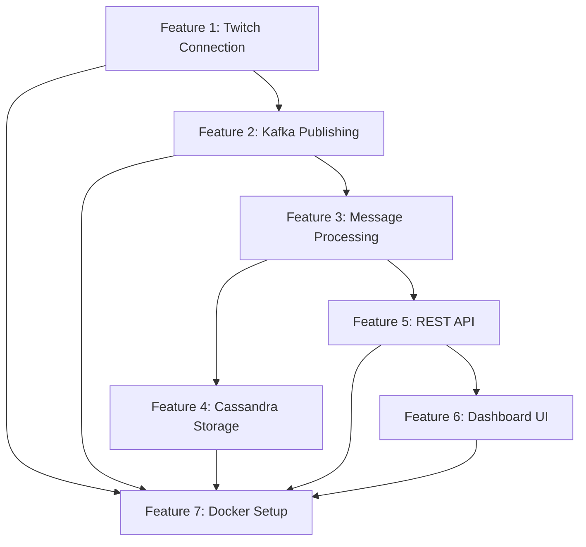

# Step 1: Groom Features for Phase 1

## Overview

Define detailed features, acceptance criteria, and scope for Phase 1 MVP. This will serve as the foundation for architecture and development planning.

## Current Phase 1 Scope (from Draft.md)

- Single channel support
- Basic Kafka ingestion
- Simple Cassandra storage
- Basic dashboard with live chat count

## Feature Breakdown

### Feature 1: Twitch Chat Connection & Ingestion

**Description:** Connect to a single Twitch channel's chat and ingest messages into Kafka.

**User Story:** As a system, I need to connect to a Twitch channel's IRC chat and forward all messages to Kafka so that they can be processed and stored.

**Acceptance Criteria:**

- [ ] Successfully connect to Twitch IRC chat for a single channel
- [ ] Parse incoming chat messages (username, message text, timestamp, emotes if available)
- [ ] Handle connection errors and reconnection logic
- [ ] Publish messages to Kafka topic with proper schema
- [ ] Handle rate limiting gracefully
- [ ] Log connection status and message ingestion rate

**Technical Requirements:**

- Twitch IRC connection (using `tmi.js` or similar library)
- Kafka producer configured for chat messages
- Message schema: `{ channel_id, user_id, username, message, timestamp, emotes[] }`
- Error handling and retry logic

**Dependencies:** None (foundational)

**Out of Scope:**

- Multiple channels (Phase 2)
- Authentication/authorization
- Message filtering

---

### Feature 2: Kafka Topic Setup & Message Publishing

**Description:** Configure Kafka topics and implement message publishing from Twitch chat.

**User Story:** As a developer, I need Kafka topics configured so that chat messages can be reliably ingested and consumed by downstream services.

**Acceptance Criteria:**

- [ ] Kafka topic created for chat messages (e.g., `twitch-chat-messages`)
- [ ] Producer publishes messages with proper partitioning strategy
- [ ] Messages include all required fields (channel_id, user_id, message, timestamp, emotes)
- [ ] Producer handles errors and retries
- [ ] Message serialization (JSON or Avro)

**Technical Requirements:**

- Kafka topic configuration (replication factor, partitions)
- Partitioning strategy decision (single topic with channel_id key vs separate topics)
- Producer configuration (acks, retries, batch size)
- Schema definition for messages

**Dependencies:** Feature 1 (Twitch connection)

**Out of Scope:**

- Multiple topics per channel
- Schema registry (can add in Phase 2)
- Complex partitioning logic

---

### Feature 3: Basic Message Processing & Aggregation

**Description:** Consume messages from Kafka and calculate basic statistics (total chat count).

**User Story:** As a system, I need to process chat messages from Kafka and calculate real-time statistics so that the dashboard can display current activity.

**Acceptance Criteria:**

- [ ] Kafka consumer reads messages from topic
- [ ] Calculate total message count per channel
- [ ] Update statistics in real-time (sliding window or time-based)
- [ ] Handle consumer lag and errors gracefully
- [ ] Basic aggregation logic (count messages per channel)

**Technical Requirements:**

- Kafka consumer with proper group configuration
- In-memory aggregation (or simple state store)
- Time window tracking (e.g., last 10 minutes)
- Consumer offset management

**Dependencies:** Feature 2 (Kafka topic setup)

**Out of Scope:**

- Complex analytics (top emotes, top users - Phase 2)
- Persistent state store (can use in-memory for MVP)
- Multiple consumer groups

---

### Feature 4: Cassandra Storage - Raw Messages

**Description:** Store raw chat messages in Cassandra for historical access.

**User Story:** As a system, I need to persist chat messages in Cassandra so that historical data is available for future analysis and replay.

**Acceptance Criteria:**

- [ ] Cassandra keyspace and table created for raw messages
- [ ] Messages written to Cassandra with proper schema
- [ ] TTL configured for data retention (e.g., 7 days)
- [ ] Handle write errors and retries
- [ ] Verify data is queryable after writes

**Technical Requirements:**

- Cassandra table schema: `raw_chat_messages`
  - Primary key: `(channel_id, timestamp, message_id)`
  - Columns: `user_id`, `username`, `message`, `emotes`
  - TTL: 7 days (configurable)
- Batch writes for efficiency
- Connection pooling and error handling

**Dependencies:** Feature 3 (Message processing)

**Out of Scope:**

- Aggregated stats table (Phase 2)
- Materialized views
- Complex queries

---

### Feature 5: REST API for Dashboard Data

**Description:** Expose REST API endpoints to serve real-time statistics to the frontend.

**User Story:** As a frontend developer, I need REST API endpoints that provide current chat statistics so that the dashboard can display live data.

**Acceptance Criteria:**

- [ ] GET endpoint: `/api/channels/:channelId/stats` returns current statistics
- [ ] Response includes: total message count, current time window
- [ ] Data updates in near real-time (within 1-2 seconds)
- [ ] Proper error handling and status codes
- [ ] API documentation (OpenAPI/Swagger or README)

**Technical Requirements:**

- Express.js or Fastify API server
- Endpoint structure:
  - `GET /api/channels/:channelId/stats` - Current statistics
  - `GET /api/health` - Health check
- Data source: In-memory aggregation or query Cassandra
- CORS enabled for frontend

**Dependencies:** Feature 3 (Message processing)

**Out of Scope:**

- WebSocket/SSE for real-time updates (can add later)
- Authentication
- Rate limiting
- Complex filtering

---

### Feature 6: Basic Dashboard UI

**Description:** Simple web interface displaying live chat count for a single channel.

**User Story:** As a user, I need to see the current chat activity for a Twitch channel so that I can monitor engagement in real-time.

**Acceptance Criteria:**

- [ ] Input field to enter Twitch channel name
- [ ] Button to start/stop monitoring
- [ ] Display current message count (updates in real-time)
- [ ] Show connection status (connected/disconnected)
- [ ] Basic styling and responsive layout
- [ ] Error messages for invalid channels or connection failures

**Technical Requirements:**

- React or Vue.js frontend (or vanilla JS for simplicity)
- Polling API every 1-2 seconds for updates
- Simple UI components:
  - Channel input
  - Start/Stop button
  - Statistics display card
  - Connection status indicator
- Basic CSS/styling

**Dependencies:** Feature 5 (REST API)

**Out of Scope:**

- Graphs/charts (Phase 2)
- Multiple channels display (Phase 2)
- Time window selection (Phase 2)
- Advanced UI features

---

### Feature 7: Docker Compose Setup

**Description:** Containerize all services (Kafka, Cassandra, Backend, Frontend) for easy local development.

**User Story:** As a developer, I need a Docker Compose setup so that I can run the entire stack locally with a single command.

**Acceptance Criteria:**

- [ ] Docker Compose file with all services
- [ ] Kafka and Zookeeper containers
- [ ] Cassandra container
- [ ] Backend API container
- [ ] Frontend container (or serve via backend)
- [ ] Environment variables for configuration
- [ ] Services start in correct order
- [ ] Health checks for services

**Technical Requirements:**

- `docker-compose.yml` with:
  - Zookeeper
  - Kafka
  - Cassandra
  - Backend API (Node.js)
  - Frontend (or nginx serving static files)
- Environment configuration
- Volume mounts for data persistence
- Network configuration

**Dependencies:** All features above

**Out of Scope:**

- Production deployment configuration
- Kubernetes setup
- Monitoring/logging infrastructure

---

## Feature Dependencies Diagram

## Scope Boundaries

### In Scope for Phase 1:

- Single Twitch channel monitoring
- Basic message ingestion to Kafka
- Simple message count aggregation
- Raw message storage in Cassandra
- Basic REST API
- Simple dashboard UI
- Local Docker Compose setup

### Out of Scope (Phase 2+):

- Multiple channels
- Top emotes calculation
- Top user tracking
- Time window selection UI
- Graphs and charts
- Aggregated stats table in Cassandra
- WebSocket/SSE for real-time updates
- Authentication/authorization
- Production deployment

## Deliverables

1. **Feature Specification Document** - Detailed breakdown of each feature
2. **Acceptance Criteria Checklist** - For each feature
3. **Technical Requirements List** - Technologies, libraries, configurations
4. **Dependency Map** - Visual representation of feature dependencies
5. **Updated Draft.md** - Phase 1 section updated with groomed features

## Next Steps

After completing Step 1, proceed to:

- **Step 2:** Backend Architecture (system design, component interactions, data flow)
- **Step 3:** Frontend Architecture (component structure, state management, API integration)
- **Step 4:** Development Milestones (sprint planning, task breakdown, timeline)