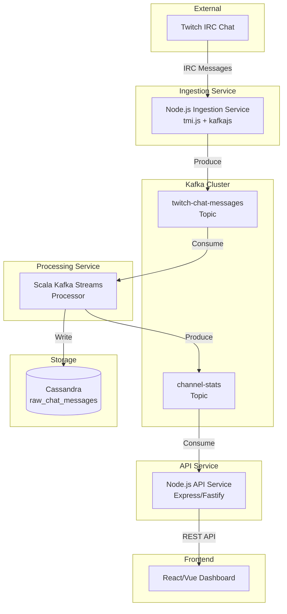
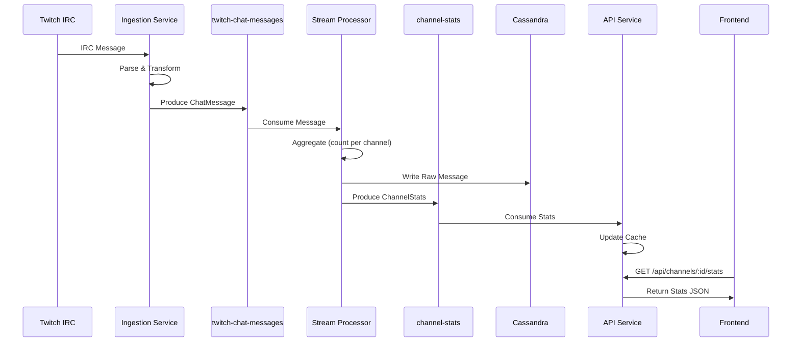

# Step 2: Backend Architecture

## Overview

Design the backend architecture for Phase 1 MVP using a microservices approach with Kafka Streams (Scala) for stream processing. This architecture will support single-channel monitoring with real-time message count aggregation.

**Architecture Pattern:** Microservices with Kafka as the communication layer  
**Processing Approach:** Kafka Streams (Scala Microservice)  
**Stack:** Node.js/TypeScript + Scala + Kafka + Cassandra

---

## System Architecture Overview

### High-Level Architecture



---

## Microservices Breakdown

### Service 1: Twitch Ingestion Service (Node.js/TypeScript)

**Purpose:** Connect to Twitch IRC and produce messages to Kafka

**Responsibilities:**

- Establish IRC connection to Twitch chat
- Parse incoming chat messages
- Transform messages to Kafka message format
- Produce messages to `twitch-chat-messages` topic
- Handle connection errors and reconnections
- Monitor connection health

**Technology Stack:**

- **Runtime:** Node.js
- **Language:** TypeScript
- **Libraries:**
  - `tmi.js` - Twitch IRC client
  - `kafkajs` - Kafka producer
  - `winston` or `pino` - Logging

**Key Components:**

```
twitch-ingestion-service/
├── src/
│   ├── twitch/
│   │   ├── TwitchClient.ts       # IRC connection management
│   │   └── MessageParser.ts      # Parse IRC messages
│   ├── kafka/
│   │   ├── Producer.ts           # Kafka producer setup
│   │   └── MessageSerializer.ts # Message transformation
│   ├── config/
│   │   └── config.ts             # Configuration management
│   └── index.ts                  # Service entry point
├── package.json
└── Dockerfile
```

---

### Service 2: Stream Processing Service (Scala)

**Purpose:** Process messages from Kafka using Kafka Streams, perform aggregations, and write results

**Responsibilities:**

- Consume messages from `twitch-chat-messages` topic
- Aggregate message counts per channel (time-windowed)
- Write aggregated stats to `channel-stats` topic
- Write raw messages to Cassandra
- Manage state stores for aggregations
- Handle windowing and time-based aggregations

**Technology Stack:**

- **Runtime:** JVM (Java 11+)
- **Language:** Scala 2.13 or 3.x
- **Libraries:**
  - `kafka-streams-scala` - Kafka Streams for Scala
  - `cassandra-driver` - DataStax Cassandra driver
  - `circe` or `play-json` - JSON serialization
  - `logback` - Logging

**Key Components:**

```
stream-processing-service/
├── src/main/scala/
│   ├── StreamTopology.scala      # Kafka Streams topology definition
│   ├── models/
│   │   ├── ChatMessage.scala     # Message case classes
│   │   └── ChannelStats.scala    # Stats case classes
│   ├── processors/
│   │   ├── MessageAggregator.scala # Aggregation logic
│   │   └── CassandraWriter.scala   # Cassandra write logic
│   ├── config/
│   │   └── StreamsConfig.scala    # Kafka Streams configuration
│   └── Main.scala                 # Application entry point
├── build.sbt
└── Dockerfile
```

---

### Service 3: API Service (Node.js/TypeScript)

**Purpose:** Serve REST API endpoints for the frontend dashboard

**Responsibilities:**

- Consume aggregated stats from `channel-stats` topic
- Maintain in-memory cache of latest stats (or query Cassandra)
- Expose REST API endpoints
- Handle CORS for frontend
- Provide health check endpoints
- Error handling and validation

**Technology Stack:**

- **Runtime:** Node.js
- **Language:** TypeScript
- **Libraries:**
  - `express` or `fastify` - Web framework
  - `kafkajs` - Kafka consumer for stats
  - `cors` - CORS middleware
  - `winston` or `pino` - Logging

**Key Components:**

```
api-service/
├── src/
│   ├── api/
│   │   ├── routes/
│   │   │   ├── channels.ts       # Channel stats endpoints
│   │   │   └── health.ts         # Health check endpoints
│   │   └── middleware/
│   │       ├── errorHandler.ts   # Error handling
│   │       └── cors.ts           # CORS configuration
│   ├── kafka/
│   │   └── StatsConsumer.ts      # Consume from channel-stats topic
│   ├── cache/
│   │   └── StatsCache.ts         # In-memory stats cache
│   ├── config/
│   │   └── config.ts             # Configuration
│   └── index.ts                  # Service entry point
├── package.json
└── Dockerfile
```

---

## Data Flow

### End-to-End Data Flow



### Message Flow Details

1. **Twitch → Ingestion Service**

   - IRC message received: `"user123: Hello chat!"`
   - Parsed into structured format
   - Transformed to Kafka message format

2. **Ingestion → Kafka Topic**

   - Message produced to `twitch-chat-messages` topic
   - Key: `channel_id` (for partitioning)
   - Value: JSON serialized ChatMessage

3. **Kafka → Stream Processor**

   - Kafka Streams consumes from `twitch-chat-messages`
   - Groups by `channel_id`
   - Applies time window (e.g., 10 minutes)
   - Counts messages per window

4. **Stream Processor → Outputs**

   - Aggregated stats → `channel-stats` topic
   - Raw messages → Cassandra (async write)

5. **Kafka → API Service**
   - API service consumes from `channel-stats` topic
   - Updates in-memory cache
   - Serves via REST API

---

## Technology Stack

### Infrastructure

| Component            | Technology       | Version | Purpose                  |
| -------------------- | ---------------- | ------- | ------------------------ |
| **Message Broker**   | Apache Kafka     | 3.x     | Event streaming platform |
| **Database**         | Apache Cassandra | 4.x     | Time-series data storage |
| **Containerization** | Docker           | Latest  | Service containerization |
| **Orchestration**    | Docker Compose   | Latest  | Local development        |

### Service Technologies

| Service        | Language   | Framework       | Key Libraries                         |
| -------------- | ---------- | --------------- | ------------------------------------- |
| **Ingestion**  | TypeScript | Node.js         | tmi.js, kafkajs                       |
| **Processing** | Scala      | Kafka Streams   | kafka-streams-scala, cassandra-driver |
| **API**        | TypeScript | Express/Fastify | kafkajs, express/fastify              |

---

## Kafka Topics Design

### Topic 1: `twitch-chat-messages`

**Purpose:** Ingest raw chat messages from Twitch

**Configuration:**

- **Partitions:** 3 (for Phase 1, can scale later)
- **Replication Factor:** 1 (local dev), 3 (production)
- **Retention:** 7 days
- **Key:** `channel_id` (String)
- **Value:** ChatMessage (JSON)

**Message Schema:**

```json
{
  "channel_id": "channel123",
  "user_id": "user456",
  "username": "viewer123",
  "message": "Hello chat!",
  "timestamp": 1234567890,
  "emotes": ["Kappa", "PogChamp"]
}
```

**Partitioning Strategy:**

- Partition by `channel_id` hash
- Ensures messages for same channel go to same partition
- Enables efficient processing in Kafka Streams

---

### Topic 2: `channel-stats`

**Purpose:** Store aggregated statistics per channel

**Configuration:**

- **Partitions:** 3
- **Replication Factor:** 1 (local dev), 3 (production)
- **Retention:** 1 day (stats are time-windowed)
- **Key:** `channel_id` (String)
- **Value:** ChannelStats (JSON)

**Message Schema:**

```json
{
  "channel_id": "channel123",
  "message_count": 1250,
  "window_start": 1234567890,
  "window_end": 1234573890,
  "window_duration_seconds": 600
}
```

**Compaction Strategy:**

- Use log compaction to keep latest stats per channel
- Older windowed stats can be discarded

---

## Cassandra Schema Design

### Learning Focus: Deep Cassandra Understanding

This project provides excellent opportunities to learn Cassandra's core concepts:

- **Data Modeling:** Partition keys, clustering keys, and query-driven design
- **Time-Series Data:** Optimizing for time-based queries and TTL management
- **Partitioning Strategy:** Understanding how data is distributed across nodes
- **Clustering:** Sorting and organizing data within partitions
- **TTL & Data Lifecycle:** Automatic data expiration and cleanup
- **Batch Operations:** Efficient bulk writes for high-throughput scenarios
- **Connection Pooling:** Managing connections in a distributed system
- **Consistency Levels:** Understanding tunable consistency (Phase 2)

---

### Keyspace: `twitch_chat`

**Purpose:** Logical container for related tables

**Schema:**

```cql
CREATE KEYSPACE IF NOT EXISTS twitch_chat
WITH REPLICATION = {
  'class': 'SimpleStrategy',
  'replication_factor': 1
};
```

**Learning Points:**

1. **Replication Strategy:**

   - `SimpleStrategy` - For single datacenter (local dev)
   - `NetworkTopologyStrategy` - For multi-datacenter (production)
   - `replication_factor: 1` - Each row stored on 1 node (dev only)
   - Production would use `replication_factor: 3` for fault tolerance

2. **Keyspace Design:**

   - Logical grouping of related tables
   - Replication settings apply to all tables in keyspace
   - Can have multiple keyspaces for different applications

---

### Table: `raw_chat_messages`

**Purpose:** Store raw chat messages for historical access and replay functionality

**Schema:**

```cql
CREATE TABLE IF NOT EXISTS twitch_chat.raw_chat_messages (
    channel_id TEXT,
    timestamp BIGINT,
    message_id UUID,
    user_id TEXT,
    username TEXT,
    message TEXT,
    emotes LIST<TEXT>,
    PRIMARY KEY ((channel_id), timestamp, message_id)
) WITH CLUSTERING ORDER BY (timestamp DESC)
  AND default_time_to_live = 604800; -- 7 days TTL
  AND compaction = {
    'class': 'TimeWindowCompactionStrategy',
    'compaction_window_unit': 'DAYS',
    'compaction_window_size': 1
  };
```

---

### Deep Dive: Primary Key Design

**Primary Key Structure:** `((channel_id), timestamp, message_id)`

#### 1. Partition Key: `(channel_id)`

**What You'll Learn:**

- **Partitioning:** How Cassandra distributes data across nodes
- **Data Locality:** All messages for a channel stored together
- **Query Efficiency:** Single partition queries are fast (no cross-partition scans)
- **Hot Partitions:** Understanding partition size limits (~2GB recommended)

**Why This Design:**

- All queries filter by `channel_id` first
- Ensures all messages for a channel are in the same partition
- Enables efficient time-range queries within a channel
- Prevents cross-partition queries (which are slow)

**Partition Distribution:**

```
Node 1: [channel_123] → 50,000 messages
Node 2: [channel_456] → 30,000 messages
Node 3: [channel_789] → 40,000 messages
```

**Learning Exercise:**

- Monitor partition sizes using `nodetool`
- Understand how partition key hash determines node placement
- Learn about partition key cardinality (too few = hot partitions, too many = overhead)

---

#### 2. Clustering Keys: `timestamp, message_id`

**What You'll Learn:**

- **Clustering:** How data is sorted within a partition
- **Sorting:** Automatic sorting by clustering keys
- **Range Queries:** Efficient time-range queries within a partition
- **Uniqueness:** Combining clustering keys for unique rows

**Clustering Order:**

- `timestamp DESC` - Most recent messages first
- `message_id` - Ensures uniqueness when timestamps are identical (rare but possible)

**Data Layout Within Partition:**

```
Partition: channel_123
├── timestamp: 1234573890, message_id: uuid-1 (most recent)
├── timestamp: 1234573880, message_id: uuid-2
├── timestamp: 1234573870, message_id: uuid-3
└── timestamp: 1234567890, message_id: uuid-4 (oldest)
```

**Why This Ordering:**

- Recent messages are accessed most frequently
- DESC ordering puts hot data at the "top" of the partition
- Efficient for "get last N messages" queries

---

### Deep Dive: Data Types & Collections

**What You'll Learn:**

1. **TEXT vs VARCHAR:**

   - `TEXT` - UTF-8 string (recommended)
   - `VARCHAR` - Similar but less common
   - Understanding when to use each

2. **BIGINT for Timestamps:**

   - Unix timestamp in milliseconds
   - More efficient than TIMESTAMP type
   - Easier range queries
   - Learn: Why not use TIMESTAMP type? (timezone issues, storage)

3. **UUID for Message IDs:**

   - Ensures uniqueness across distributed system
   - No coordination needed (unlike auto-increment)
   - Learn: UUID v1 vs v4 trade-offs

4. **LIST<TEXT> for Emotes:**

   - Collection type for multiple values
   - Learn: When to use LIST vs SET vs MAP
   - Understand: Collection size limits and performance implications

---

### Deep Dive: TTL (Time To Live)

**What You'll Learn:**

- **Automatic Expiration:** Data automatically deleted after TTL
- **TTL at Write Time:** TTL can be set per-row or per-table
- **TTL Calculation:** TTL countdown starts when row is written
- **TTL Updates:** Updating a row resets its TTL

**TTL Configuration:**

```cql
-- Table-level TTL (default for all rows)
default_time_to_live = 604800; -- 7 days in seconds

-- Row-level TTL (override for specific rows)
INSERT INTO raw_chat_messages (...) VALUES (...)
USING TTL 86400; -- 1 day for this specific row
```

**Learning Exercises:**

- Monitor TTL expiration using `ttl()` function
- Understand TTL behavior with updates
- Learn about tombstone handling (deleted rows)
- Experiment with different TTL values

**TTL Query Example:**

```cql
-- Check remaining TTL for a row
SELECT channel_id, timestamp, message, TTL(message) as ttl_seconds
FROM raw_chat_messages
WHERE channel_id = 'channel123'
LIMIT 10;
```

---

### Deep Dive: Compaction Strategy

**What You'll Learn:**

- **Compaction:** How Cassandra merges and cleans up data files (SSTables)
- **TimeWindowCompactionStrategy:** Optimized for time-series data
- **Tombstone Handling:** How deleted/expired data is cleaned up
- **Disk Space Management:** Understanding disk usage patterns

**Compaction Configuration:**

```cql
compaction = {
  'class': 'TimeWindowCompactionStrategy',
  'compaction_window_unit': 'DAYS',
  'compaction_window_size': 1
}
```

**Why TimeWindowCompactionStrategy:**

- Optimized for time-series data (our use case)
- Groups data by time windows
- Efficient for TTL expiration
- Reduces compaction overhead

**Learning Points:**

- Understand different compaction strategies:
  - `SizeTieredCompactionStrategy` (default)
  - `LeveledCompactionStrategy` (for read-heavy)
  - `TimeWindowCompactionStrategy` (for time-series)
- Monitor compaction performance
- Understand compaction impact on read/write performance

---

### Query Patterns & Optimization

#### Pattern 1: Get All Messages for a Channel

**Query:**

```cql
SELECT * FROM raw_chat_messages
WHERE channel_id = 'channel123';
```

**What You'll Learn:**

- **Partition Query:** Single partition read (very fast)
- **Automatic Sorting:** Results sorted by clustering keys (timestamp DESC)
- **Pagination:** Using LIMIT for result size control

**Performance:**

- ✅ Fast: Single partition read
- ✅ Efficient: No cross-partition scan
- ⚠️ Can be slow if partition is very large (use pagination)

---

#### Pattern 2: Get Recent Messages (Time Range)

**Query:**

```cql
SELECT * FROM raw_chat_messages
WHERE channel_id = 'channel123'
  AND timestamp > 1234567890
ORDER BY timestamp DESC;
```

**What You'll Learn:**

- **Range Queries:** Efficient within-partition range scans
- **Clustering Key Filters:** Using clustering keys in WHERE clause
- **Ordering:** Understanding when ORDER BY is needed (usually not, due to clustering)

**Performance:**

- ✅ Fast: Single partition, range scan
- ✅ Efficient: Uses clustering key index
- ⚠️ Large time ranges may scan many rows

---

#### Pattern 3: Get Last N Messages

**Query:**

```cql
SELECT * FROM raw_chat_messages
WHERE channel_id = 'channel123'
LIMIT 100;
```

**What You'll Learn:**

- **LIMIT Clause:** Controlling result set size
- **Efficient Pagination:** Using token() for cursor-based pagination
- **Memory Management:** Limiting result sizes for large partitions

**Pagination Example:**

```cql
-- First page
SELECT * FROM raw_chat_messages
WHERE channel_id = 'channel123'
LIMIT 100;

-- Next page (using last timestamp as cursor)
SELECT * FROM raw_chat_messages
WHERE channel_id = 'channel123'
  AND timestamp < 1234567890  -- Last timestamp from previous page
LIMIT 100;
```

---

### Advanced Query Patterns (Phase 2+)

#### Pattern 4: Count Messages in Time Window

**Query:**

```cql
SELECT COUNT(*) FROM raw_chat_messages
WHERE channel_id = 'channel123'
  AND timestamp >= 1234567890
  AND timestamp <= 1234573890;
```

**What You'll Learn:**

- **Aggregations:** COUNT, SUM, AVG functions
- **Performance:** Aggregations can be expensive (consider pre-aggregation)
- **Alternative:** Use materialized views or aggregated tables

---

#### Pattern 5: Get Messages by User

**Note:** This query pattern is **NOT efficient** with current schema!

**Inefficient Query:**

```cql
-- This requires ALLOW FILTERING (bad practice!)
SELECT * FROM raw_chat_messages
WHERE channel_id = 'channel123'
  AND user_id = 'user456'
ALLOW FILTERING;  -- ⚠️ Very slow!
```

**What You'll Learn:**

- **Query-Driven Design:** Schema must match query patterns
- **ALLOW FILTERING:** Why it's bad (full partition scan)
- **Secondary Indexes:** When to use them (and when not to)
- **Materialized Views:** Alternative approach for different query patterns

**Better Approach (Phase 2):**

Create a materialized view or separate table:

```cql
CREATE MATERIALIZED VIEW messages_by_user AS
SELECT channel_id, user_id, timestamp, message_id, message
FROM raw_chat_messages
WHERE channel_id IS NOT NULL
  AND user_id IS NOT NULL
  AND timestamp IS NOT NULL
  AND message_id IS NOT NULL
PRIMARY KEY ((channel_id, user_id), timestamp, message_id);
```

---

### Write Patterns & Optimization

#### Batch Writes

**What You'll Learn:**

- **Batch Operations:** Grouping multiple writes for efficiency
- **Batch Types:** LOGGED vs UNLOGGED vs COUNTER
- **Batch Size Limits:** Understanding batch size constraints
- **Performance:** When batching helps vs hurts

**Example:**

```cql
BEGIN BATCH
  INSERT INTO raw_chat_messages (...) VALUES (...);
  INSERT INTO raw_chat_messages (...) VALUES (...);
  INSERT INTO raw_chat_messages (...) VALUES (...);
APPLY BATCH;
```

**Learning Points:**

- Batch writes to same partition = efficient
- Batch writes across partitions = less efficient
- Large batches can cause timeouts
- Optimal batch size: 50-100 rows

---

#### Async Writes from Stream Processor

**Scala Example:**

```scala
// Batch write to Cassandra
val batch = new BatchStatement(BatchStatement.Type.UNLOGGED)
messages.foreach { message =>
  val stmt = insertInto("twitch_chat", "raw_chat_messages")
    .value("channel_id", message.channelId)
    .value("timestamp", message.timestamp)
    .value("message_id", message.messageId)
    .value("user_id", message.userId)
    .value("username", message.username)
    .value("message", message.message)
    .value("emotes", message.emotes.asJava)

  batch.add(stmt)

  if (batch.size() >= 50) {
    session.execute(batch)
    batch.clear()
  }
}
```

**What You'll Learn:**

- **Connection Pooling:** Managing Cassandra connections
- **Async Operations:** Non-blocking writes from stream processor
- **Error Handling:** Retry logic for failed writes
- **Backpressure:** Handling write rate vs processing rate

---

### Consistency Levels & Tuning

**What You'll Learn (Phase 2):**

Cassandra offers tunable consistency:

- **ONE:** Fastest, reads from one node
- **QUORUM:** Balanced, reads from majority
- **ALL:** Strongest, reads from all replicas

**Example:**

```cql
-- Write with QUORUM consistency
INSERT INTO raw_chat_messages (...)
VALUES (...)
USING CONSISTENCY QUORUM;
```

**Learning Points:**

- Understand CAP theorem trade-offs
- When to use different consistency levels
- Performance vs consistency trade-offs
- How consistency affects availability

---

### Monitoring & Maintenance

**What You'll Learn:**

1. **Nodetool Commands:**

   ```bash
   # Check cluster status
   nodetool status

   # Check table statistics
   nodetool tablestats twitch_chat.raw_chat_messages

   # Check compaction status
   nodetool compactionstats
   ```

2. **CQLSH Commands:**

   ```bash
   # Connect to cluster
   cqlsh localhost

   # Describe keyspace
   DESCRIBE KEYSPACE twitch_chat;

   # Check table schema
   DESCRIBE TABLE raw_chat_messages;
   ```

3. **Performance Monitoring:**

   - Monitor read/write latency
   - Track partition sizes
   - Monitor compaction performance
   - Watch for hot partitions

---

### Data Modeling Best Practices Learned

**Key Takeaways:**

1. **Query-Driven Design:**

   - Design schema based on query patterns
   - Denormalize data if needed
   - Create multiple tables for different query patterns

2. **Partition Key Selection:**

   - Choose partition key that matches query filters
   - Avoid hot partitions (too much data in one partition)
   - Balance partition size (aim for < 100MB per partition)

3. **Clustering Key Design:**

   - Use clustering keys for sorting and uniqueness
   - Order by most common query pattern
   - Consider query performance when choosing order

4. **TTL Strategy:**

   - Use TTL for automatic data cleanup
   - Set appropriate TTL based on data retention needs
   - Understand TTL behavior with updates

5. **Collection Types:**

   - Use collections sparingly (performance impact)
   - Keep collection sizes small (< 100 items)
   - Consider separate tables for large collections

---

### Phase 1 vs Phase 2+ Schema Evolution

**Phase 1 (Current):**

- Single table for raw messages
- Basic time-series queries
- Simple TTL management

**Phase 2+ (Future Enhancements):**

- Materialized views for different query patterns
- Aggregated stats tables
- Secondary indexes (if needed, with caution)
- Multiple keyspaces for different data types
- More complex data models for analytics

---

## API Design

### Base URL

```
http://localhost:3000/api
```

### Endpoints

#### GET `/api/channels/:channelId/stats`

Get current statistics for a channel.

**Path Parameters:**

- `channelId` (string, required) - Twitch channel ID or name

**Response:**

```json
{
  "channel_id": "channel123",
  "message_count": 1250,
  "current_window": {
    "start": 1234567890,
    "end": 1234573890,
    "duration_seconds": 600
  },
  "last_updated": 1234570000
}
```

**Status Codes:**

- `200 OK` - Success
- `404 Not Found` - Channel not found or no data
- `500 Internal Server Error` - Server error

---

#### GET `/api/health`

Health check endpoint.

**Response:**

```json
{
  "status": "healthy",
  "timestamp": 1234567890,
  "services": {
    "kafka": "connected",
    "cache": "ready"
  }
}
```

**Status Codes:**

- `200 OK` - All services healthy
- `503 Service Unavailable` - One or more services down

---

## Service Configuration

### Environment Variables

#### Ingestion Service

```bash
# Twitch Configuration
TWITCH_CHANNEL=channelname
TWITCH_USERNAME=your_bot_username
TWITCH_OAUTH_TOKEN=oauth:token

# Kafka Configuration
KAFKA_BROKERS=localhost:9092
KAFKA_TOPIC_CHAT_MESSAGES=twitch-chat-messages
KAFKA_CLIENT_ID=twitch-ingestion-service

# Logging
LOG_LEVEL=info
```

#### Stream Processing Service

```bash
# Kafka Configuration
KAFKA_BOOTSTRAP_SERVERS=localhost:9092
KAFKA_APPLICATION_ID=stream-processor
KAFKA_TOPIC_INPUT=twitch-chat-messages
KAFKA_TOPIC_OUTPUT=channel-stats

# Streams Configuration
WINDOW_SIZE_SECONDS=600  # 10 minutes
STATE_DIR=/tmp/kafka-streams-state

# Cassandra Configuration
CASSANDRA_HOSTS=localhost:9042
CASSANDRA_KEYSPACE=twitch_chat
CASSANDRA_TABLE=raw_chat_messages

# Logging
LOG_LEVEL=info
```

#### API Service

```bash
# Server Configuration
PORT=3000
NODE_ENV=development

# Kafka Configuration
KAFKA_BROKERS=localhost:9092
KAFKA_TOPIC_STATS=channel-stats
KAFKA_GROUP_ID=api-service-consumer

# CORS
CORS_ORIGIN=http://localhost:5173

# Logging
LOG_LEVEL=info
```

---

## Error Handling & Resilience

### Ingestion Service

**Error Scenarios:**

1. **Twitch Connection Lost**

   - Implement exponential backoff retry
   - Log connection status
   - Emit health metrics

2. **Kafka Producer Errors**

   - Retry with exponential backoff
   - Dead letter queue for failed messages (Phase 2)
   - Alert on persistent failures

3. **Message Parsing Errors**
   - Log malformed messages
   - Skip invalid messages (don't crash)
   - Emit error metrics

---

### Stream Processing Service

**Error Scenarios:**

1. **Kafka Consumer Errors**

   - Kafka Streams handles automatically
   - Checkpoint offsets regularly
   - Monitor consumer lag

2. **Cassandra Write Errors**

   - Retry with exponential backoff
   - Batch writes for efficiency
   - Don't block stream processing (async writes)

3. **State Store Errors**
   - Kafka Streams handles state recovery
   - Monitor state store size
   - Alert on state corruption

---

### API Service

**Error Scenarios:**

1. **Kafka Consumer Errors**

   - Retry connection
   - Fallback to Cassandra query if Kafka unavailable
   - Cache last known good state

2. **Cache Miss**
   - Query Cassandra for historical data
   - Return empty stats if no data available
   - Log cache misses for monitoring

---

## Deployment Architecture

### Docker Compose Structure

```yaml
version: "3.8"

services:
  zookeeper:
    image: confluentinc/cp-zookeeper:latest
    # ... configuration

  kafka:
    image: confluentinc/cp-kafka:latest
    depends_on:
      - zookeeper
    # ... configuration

  cassandra:
    image: cassandra:4.1
    # ... configuration

  twitch-ingestion:
    build: ./services/twitch-ingestion
    depends_on:
      - kafka
    environment:
      # ... env vars
    # ... configuration

  stream-processor:
    build: ./services/stream-processor
    depends_on:
      - kafka
      - cassandra
    environment:
      # ... env vars
    # ... configuration

  api-service:
    build: ./services/api-service
    depends_on:
      - kafka
      - cassandra
    ports:
      - "3000:3000"
    # ... configuration
```

### Service Startup Order

1. **Infrastructure:** Zookeeper → Kafka → Cassandra
2. **Services:** Ingestion → Stream Processor → API Service
3. **Health Checks:** Wait for dependencies before starting

---

## Monitoring & Observability

### Logging Strategy

**All Services:**

- Structured logging (JSON format)
- Log levels: DEBUG, INFO, WARN, ERROR
- Include correlation IDs for tracing

**Key Metrics to Log:**

- Message ingestion rate
- Processing latency
- Error rates
- Consumer lag

### Health Checks

**Each Service Should Expose:**

- `/health` endpoint
- Dependency health (Kafka, Cassandra connectivity)
- Service-specific health indicators

---

## Development Considerations

### Local Development

1. **Service Dependencies:**

   - Use Docker Compose for infrastructure
   - Run services locally or in containers
   - Hot reload for development

2. **Testing:**

   - Unit tests for each service
   - Integration tests with embedded Kafka
   - End-to-end tests with test containers

3. **Debugging:**
   - Local Kafka topics for testing
   - Log aggregation (e.g., Docker logs)
   - Kafka UI tools (Kafdrop, Kafka Manager)

---

## Phase 1 Scope Summary

### In Scope

✅ Single Twitch channel monitoring  
✅ Kafka producer (Node.js)  
✅ Kafka Streams processor (Scala)  
✅ Kafka consumer (Node.js API)  
✅ Basic message count aggregation  
✅ Time-windowed aggregations (10-minute windows)  
✅ Raw message storage in Cassandra  
✅ REST API for stats  
✅ Docker Compose setup

### Out of Scope (Phase 2+)

❌ Multiple channels  
❌ Top emotes calculation  
❌ Top user tracking  
❌ Schema registry  
❌ Dead letter queues  
❌ Advanced monitoring  
❌ Production deployment config

---

## Next Steps

After completing Step 2, proceed to:

- **Step 3:** Frontend Architecture (component structure, state management, API integration)
- **Step 4:** Development Milestones (sprint planning, task breakdown, timeline)

---

## References

- [Kafka Streams Documentation](https://kafka.apache.org/documentation/streams/)
- [Kafka Streams Scala API](https://github.com/lightbend/kafka-streams-scala)
- [Cassandra Data Modeling](https://cassandra.apache.org/doc/latest/cassandra/data_modeling/)
- [Twitch IRC Guide](https://dev.twitch.tv/docs/irc/)
