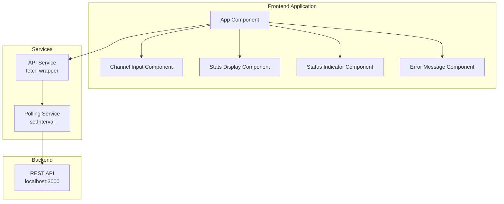
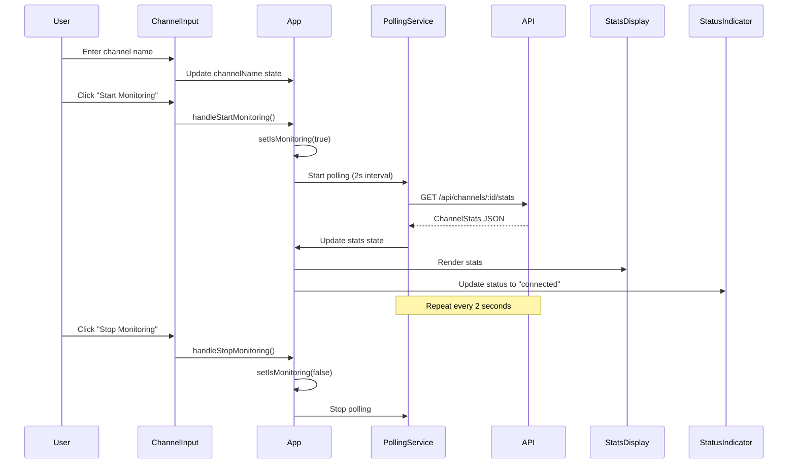

# Step 3: Frontend Architecture

## Overview

Design a minimal but usable frontend for Phase 1 MVP. Focus on core functionality with clean, maintainable code that can be easily enhanced in later phases.

**Design Philosophy:** Minimal but functional, easy to enhance  
**Framework:** React (TypeScript)  
**Styling:** CSS Modules or Tailwind CSS  
**State Management:** React Hooks (useState, useEffect)  
**API Communication:** Fetch API with polling

---

## Architecture Overview

### High-Level Architecture



---

## Technology Stack

### Core Technologies

| Component | Technology | Version | Purpose |
|-----------|-----------|---------|---------|
| **Framework** | React | 18.x | UI framework |
| **Language** | TypeScript | 5.x | Type safety |
| **Build Tool** | Vite | Latest | Fast build tool |
| **Styling** | CSS Modules / Tailwind | Latest | Component styling |
| **HTTP Client** | Fetch API | Native | API communication |

### Development Tools

| Tool | Purpose |
|------|---------|
| **ESLint** | Code linting |
| **Prettier** | Code formatting |
| **TypeScript** | Type checking |

---

## Project Structure

### Directory Layout

```
frontend/
├── public/
│   └── index.html
├── src/
│   ├── components/
│   │   ├── ChannelInput/
│   │   │   ├── ChannelInput.tsx
│   │   │   ├── ChannelInput.module.css
│   │   │   └── index.ts
│   │   ├── StatsDisplay/
│   │   │   ├── StatsDisplay.tsx
│   │   │   ├── StatsDisplay.module.css
│   │   │   └── index.ts
│   │   ├── StatusIndicator/
│   │   │   ├── StatusIndicator.tsx
│   │   │   ├── StatusIndicator.module.css
│   │   │   └── index.ts
│   │   └── ErrorMessage/
│   │       ├── ErrorMessage.tsx
│   │       ├── ErrorMessage.module.css
│   │       └── index.ts
│   ├── services/
│   │   ├── api.ts          # API service
│   │   └── polling.ts      # Polling logic
│   ├── types/
│   │   └── index.ts        # TypeScript types
│   ├── hooks/
│   │   └── usePolling.ts   # Custom polling hook
│   ├── utils/
│   │   └── constants.ts    # Constants
│   ├── App.tsx
│   ├── App.css
│   └── main.tsx
├── package.json
├── tsconfig.json
├── vite.config.ts
└── Dockerfile
```

---

## Component Design

### 1. App Component (Root)

**Purpose:** Main application container, manages global state

**Responsibilities:**
- Manage channel name state
- Manage monitoring state (started/stopped)
- Manage stats data
- Manage error state
- Coordinate polling
- Render child components

**State Management:**
```typescript
interface AppState {
  channelName: string;
  isMonitoring: boolean;
  stats: ChannelStats | null;
  error: string | null;
  connectionStatus: 'connected' | 'disconnected' | 'unknown';
}
```

**Component Structure:**
```tsx
function App() {
  const [channelName, setChannelName] = useState<string>('');
  const [isMonitoring, setIsMonitoring] = useState<boolean>(false);
  const [stats, setStats] = useState<ChannelStats | null>(null);
  const [error, setError] = useState<string | null>(null);
  const [connectionStatus, setConnectionStatus] = useState<'connected' | 'disconnected' | 'unknown'>('unknown');

  // Polling logic
  // Start/stop handlers
  // Error handling

  return (
    <div className="app">
      <ChannelInput ... />
      <StatusIndicator status={connectionStatus} />
      {error && <ErrorMessage message={error} />}
      {stats && <StatsDisplay stats={stats} />}
    </div>
  );
}
```

---

### 2. ChannelInput Component

**Purpose:** Input field and start/stop button for channel monitoring

**Props:**
```typescript
interface ChannelInputProps {
  channelName: string;
  isMonitoring: boolean;
  onChannelChange: (name: string) => void;
  onStart: () => void;
  onStop: () => void;
  disabled?: boolean;
}
```

**Features:**
- Text input for channel name
- Start button (when not monitoring)
- Stop button (when monitoring)
- Input validation (basic)
- Disabled state during operations

**UI Structure:**
```tsx
function ChannelInput({
  channelName,
  isMonitoring,
  onChannelChange,
  onStart,
  onStop,
  disabled
}: ChannelInputProps) {
  return (
    <div className="channel-input">
      <input
        type="text"
        value={channelName}
        onChange={(e) => onChannelChange(e.target.value)}
        placeholder="Enter Twitch channel name"
        disabled={isMonitoring || disabled}
      />
      {isMonitoring ? (
        <button onClick={onStop} disabled={disabled}>
          Stop Monitoring
        </button>
      ) : (
        <button onClick={onStart} disabled={!channelName || disabled}>
          Start Monitoring
        </button>
      )}
    </div>
  );
}
```

---

### 3. StatsDisplay Component

**Purpose:** Display current channel statistics

**Props:**
```typescript
interface StatsDisplayProps {
  stats: ChannelStats;
}
```

**Features:**
- Display message count (large, prominent)
- Display time window information
- Format numbers (e.g., 1,250)
- Format timestamps (relative or absolute)
- Loading state (optional)

**UI Structure:**
```tsx
function StatsDisplay({ stats }: StatsDisplayProps) {
  return (
    <div className="stats-display">
      <div className="stats-card">
        <h2>Channel: {stats.channel_id}</h2>
        <div className="message-count">
          <span className="count-value">{formatNumber(stats.message_count)}</span>
          <span className="count-label">Messages</span>
        </div>
        <div className="time-window">
          <span>Window: {formatDuration(stats.current_window.duration_seconds)}</span>
        </div>
        <div className="last-updated">
          Updated: {formatTimestamp(stats.last_updated)}
        </div>
      </div>
    </div>
  );
}
```

---

### 4. StatusIndicator Component

**Purpose:** Visual indicator of connection status

**Props:**
```typescript
interface StatusIndicatorProps {
  status: 'connected' | 'disconnected' | 'unknown';
}
```

**Features:**
- Color-coded status (green/red/gray)
- Status text
- Icon (optional, can add later)
- Pulse animation for active connection

**UI Structure:**
```tsx
function StatusIndicator({ status }: StatusIndicatorProps) {
  const statusConfig = {
    connected: { color: 'green', text: 'Connected' },
    disconnected: { color: 'red', text: 'Disconnected' },
    unknown: { color: 'gray', text: 'Unknown' }
  };

  const config = statusConfig[status];

  return (
    <div className={`status-indicator status-${status}`}>
      <span className="status-dot" style={{ backgroundColor: config.color }} />
      <span className="status-text">{config.text}</span>
    </div>
  );
}
```

---

### 5. ErrorMessage Component

**Purpose:** Display error messages to user

**Props:**
```typescript
interface ErrorMessageProps {
  message: string;
  onDismiss?: () => void;
}
```

**Features:**
- Error message display
- Dismiss button (optional)
- Auto-dismiss after timeout (optional)
- Error type styling (can enhance later)

**UI Structure:**
```tsx
function ErrorMessage({ message, onDismiss }: ErrorMessageProps) {
  return (
    <div className="error-message">
      <span className="error-text">{message}</span>
      {onDismiss && (
        <button onClick={onDismiss} className="dismiss-button">
          ×
        </button>
      )}
    </div>
  );
}
```

---

## Services Layer

### API Service

**Purpose:** Centralized API communication

**File:** `src/services/api.ts`

```typescript
const API_BASE_URL = import.meta.env.VITE_API_URL || 'http://localhost:3000/api';

export interface ChannelStats {
  channel_id: string;
  message_count: number;
  current_window: {
    start: number;
    end: number;
    duration_seconds: number;
  };
  last_updated: number;
}

export interface HealthStatus {
  status: string;
  timestamp: number;
  services: {
    kafka: string;
    cache: string;
  };
}

class ApiService {
  async getChannelStats(channelId: string): Promise<ChannelStats> {
    const response = await fetch(`${API_BASE_URL}/channels/${channelId}/stats`);
    
    if (!response.ok) {
      if (response.status === 404) {
        throw new Error(`Channel "${channelId}" not found or has no data`);
      }
      throw new Error(`Failed to fetch stats: ${response.statusText}`);
    }
    
    return response.json();
  }

  async getHealth(): Promise<HealthStatus> {
    const response = await fetch(`${API_BASE_URL}/health`);
    
    if (!response.ok) {
      throw new Error('API health check failed');
    }
    
    return response.json();
  }
}

export const apiService = new ApiService();
```

---

### Polling Service

**Purpose:** Handle polling logic for real-time updates

**File:** `src/hooks/usePolling.ts`

```typescript
import { useEffect, useRef } from 'react';

interface UsePollingOptions {
  enabled: boolean;
  interval: number; // milliseconds
  callback: () => Promise<void>;
  onError?: (error: Error) => void;
}

export function usePolling({
  enabled,
  interval,
  callback,
  onError
}: UsePollingOptions) {
  const intervalRef = useRef<NodeJS.Timeout | null>(null);

  useEffect(() => {
    if (!enabled) {
      if (intervalRef.current) {
        clearInterval(intervalRef.current);
        intervalRef.current = null;
      }
      return;
    }

    // Immediate first call
    callback().catch(onError || console.error);

    // Set up polling interval
    intervalRef.current = setInterval(() => {
      callback().catch(onError || console.error);
    }, interval);

    return () => {
      if (intervalRef.current) {
        clearInterval(intervalRef.current);
      }
    };
  }, [enabled, interval, callback, onError]);
}
```

**Usage in App:**
```typescript
usePolling({
  enabled: isMonitoring && !!channelName,
  interval: 2000, // 2 seconds
  callback: async () => {
    const stats = await apiService.getChannelStats(channelName);
    setStats(stats);
    setConnectionStatus('connected');
    setError(null);
  },
  onError: (error) => {
    setError(error.message);
    setConnectionStatus('disconnected');
  }
});
```

---

## Type Definitions

**File:** `src/types/index.ts`

```typescript
export interface ChannelStats {
  channel_id: string;
  message_count: number;
  current_window: {
    start: number;
    end: number;
    duration_seconds: number;
  };
  last_updated: number;
}

export interface HealthStatus {
  status: string;
  timestamp: number;
  services: {
    kafka: string;
    cache: string;
  };
}

export type ConnectionStatus = 'connected' | 'disconnected' | 'unknown';
```

---

## Styling Approach

### Option 1: CSS Modules (Recommended for MVP)

**Benefits:**
- Scoped styles (no conflicts)
- Simple, no build complexity
- Easy to understand
- Can migrate to styled-components later

**Example:** `StatsDisplay.module.css`
```css
.statsDisplay {
  padding: 2rem;
  max-width: 600px;
  margin: 0 auto;
}

.statsCard {
  background: white;
  border-radius: 8px;
  padding: 2rem;
  box-shadow: 0 2px 8px rgba(0, 0, 0, 0.1);
}

.countValue {
  font-size: 3rem;
  font-weight: bold;
  color: #6366f1;
}

.countLabel {
  font-size: 1rem;
  color: #6b7280;
  text-transform: uppercase;
}
```

---

### Option 2: Tailwind CSS (Alternative)

**Benefits:**
- Utility-first, fast development
- Responsive design built-in
- Consistent design system

**Setup:**
```bash
npm install -D tailwindcss postcss autoprefixer
npx tailwindcss init -p
```

**Example:**
```tsx
<div className="p-8 max-w-2xl mx-auto">
  <div className="bg-white rounded-lg shadow-lg p-8">
    <h2 className="text-2xl font-bold mb-4">Channel Stats</h2>
    <div className="text-5xl font-bold text-indigo-600">
      {stats.message_count.toLocaleString()}
    </div>
  </div>
</div>
```

---

## State Management

### Phase 1: React Hooks Only

**No Redux/Zustand needed for MVP**

**State Structure:**
```typescript
// App.tsx
const [channelName, setChannelName] = useState<string>('');
const [isMonitoring, setIsMonitoring] = useState<boolean>(false);
const [stats, setStats] = useState<ChannelStats | null>(null);
const [error, setError] = useState<string | null>(null);
const [connectionStatus, setConnectionStatus] = useState<ConnectionStatus>('unknown');
```

**Why This Works:**
- Single page application
- Simple state (5-6 values)
- No complex state interactions
- Easy to understand and debug

**Phase 2+ Consider:**
- Context API if sharing state across many components
- Zustand for lightweight global state
- Redux only if state becomes very complex

---

## Error Handling

### Error Types

1. **Network Errors:**
   - API unreachable
   - Timeout
   - CORS issues

2. **API Errors:**
   - 404: Channel not found
   - 500: Server error
   - 503: Service unavailable

3. **Validation Errors:**
   - Empty channel name
   - Invalid channel format

### Error Handling Strategy

```typescript
const handleStartMonitoring = async () => {
  // Validation
  if (!channelName.trim()) {
    setError('Please enter a channel name');
    return;
  }

  setError(null);
  setIsMonitoring(true);
  setConnectionStatus('unknown');

  try {
    // Test connection first
    await apiService.getHealth();
    setConnectionStatus('connected');
  } catch (error) {
    setError('Failed to connect to API. Please check if the backend is running.');
    setConnectionStatus('disconnected');
    setIsMonitoring(false);
  }
};
```

---

## Responsive Design

### Breakpoints (Mobile-First)

```css
/* Mobile (default) */
.container {
  padding: 1rem;
  width: 100%;
}

/* Tablet (768px+) */
@media (min-width: 768px) {
  .container {
    padding: 2rem;
    max-width: 768px;
    margin: 0 auto;
  }
}

/* Desktop (1024px+) */
@media (min-width: 1024px) {
  .container {
    max-width: 1024px;
  }
}
```

### Key Responsive Considerations

- **Input fields:** Full width on mobile, constrained on desktop
- **Buttons:** Touch-friendly size (min 44x44px)
- **Stats display:** Stack vertically on mobile, horizontal on desktop
- **Text:** Readable font sizes (min 16px on mobile)

---

## User Experience (Minimal but Usable)

### Core UX Features

1. **Immediate Feedback:**
   - Button states (disabled during operations)
   - Loading indicators (optional, can add later)
   - Status indicators

2. **Error Communication:**
   - Clear error messages
   - Actionable errors (what user can do)
   - Error dismissal

3. **Real-Time Updates:**
   - Polling every 2 seconds
   - Smooth number updates (can add animations later)
   - Connection status visibility

4. **Input Validation:**
   - Disable start button if channel name empty
   - Basic format validation (optional)

### UX Enhancements (Phase 2+)

- Loading skeletons
- Smooth animations
- Toast notifications
- Keyboard shortcuts
- Dark mode
- Accessibility improvements (ARIA labels, keyboard navigation)

---

## Environment Configuration

### Environment Variables

**File:** `.env`
```bash
VITE_API_URL=http://localhost:3000/api
VITE_POLLING_INTERVAL=2000
```

**Usage:**
```typescript
const API_URL = import.meta.env.VITE_API_URL;
const POLLING_INTERVAL = parseInt(import.meta.env.VITE_POLLING_INTERVAL || '2000');
```

---

## Build & Deployment

### Development

```bash
npm install
npm run dev
```

**Vite Dev Server:**
- Hot Module Replacement (HMR)
- Fast refresh
- Port: 5173 (default)

### Production Build

```bash
npm run build
```

**Output:**
- `dist/` directory with optimized assets
- Can be served by nginx or any static file server

### Docker Setup

**Dockerfile:**
```dockerfile
FROM node:18-alpine AS builder
WORKDIR /app
COPY package*.json ./
RUN npm ci
COPY . .
RUN npm run build

FROM nginx:alpine
COPY --from=builder /app/dist /usr/share/nginx/html
COPY nginx.conf /etc/nginx/conf.d/default.conf
EXPOSE 80
CMD ["nginx", "-g", "daemon off;"]
```

---

## Testing Strategy (Phase 1 Minimal)

### Manual Testing Checklist

- [ ] Enter channel name and start monitoring
- [ ] Verify stats update every 2 seconds
- [ ] Test stop monitoring
- [ ] Test error handling (invalid channel, API down)
- [ ] Test responsive design (mobile/tablet/desktop)
- [ ] Test connection status indicator

### Automated Testing (Phase 2+)

- Unit tests for components
- Integration tests for API service
- E2E tests with Playwright/Cypress

---

## Performance Considerations

### Phase 1 Optimizations

1. **Polling Interval:**
   - 2 seconds is reasonable for MVP
   - Can adjust based on needs

2. **Component Re-renders:**
   - Use React.memo for expensive components (if needed)
   - Avoid unnecessary re-renders

3. **Bundle Size:**
   - Vite handles tree-shaking automatically
   - Keep dependencies minimal

### Future Optimizations (Phase 2+)

- WebSocket/SSE for real-time updates (no polling)
- Code splitting
- Lazy loading
- Service workers for offline support

---

## Accessibility (Basic)

### Phase 1 Minimum

- Semantic HTML (buttons, inputs, headings)
- Basic ARIA labels (can enhance later)
- Keyboard navigation (tab order)
- Color contrast (WCAG AA minimum)

### Phase 2+ Enhancements

- Full ARIA support
- Screen reader optimization
- Keyboard shortcuts
- Focus management

---

## Phase 1 Scope Summary

### In Scope

✅ Single channel input  
✅ Start/stop monitoring  
✅ Real-time stats display (polling)  
✅ Connection status indicator  
✅ Error handling and display  
✅ Basic responsive design  
✅ Clean component structure  
✅ TypeScript for type safety  

### Out of Scope (Phase 2+)

❌ Multiple channels display  
❌ Graphs and charts  
❌ Time window selection UI  
❌ WebSocket/SSE real-time updates  
❌ Advanced animations  
❌ Dark mode  
❌ Advanced accessibility features  
❌ Complex state management  
❌ Unit/integration tests  

---

## Component Interaction Flow



---

## Next Steps

After completing Step 3, proceed to:

- **Step 4:** Development Milestones (sprint planning, task breakdown, timeline)

---

## References

- [React Documentation](https://react.dev/)
- [TypeScript Handbook](https://www.typescriptlang.org/docs/)
- [Vite Guide](https://vitejs.dev/guide/)
- [CSS Modules](https://github.com/css-modules/css-modules)

